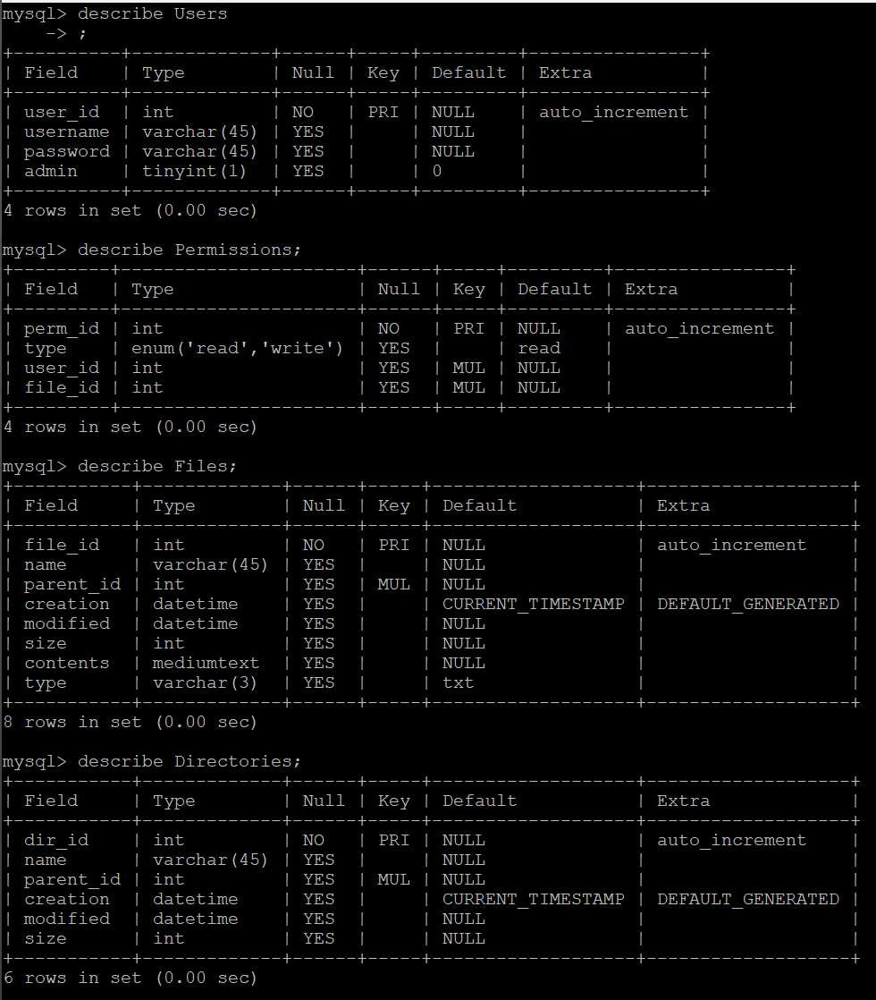

# Database Info
## How to access using myphpadmin

1. In a terminal window create a ssh tunnel by running 
```
ssh -L localhost:50080:localhost:50080 USERNAME@cs506-team-31.cs.wisc.edu
```
2. Leave that terminal open, go to [http://localhost:50080/](http://localhost:50080/)

3. Select FileSystem from the list of databases on the left side

## How to access from group vm

1. ssh into the group vm

2. run ```mysql -h localhost -P 53306 --protocol=TCP -u root -p```
3. password is ```506studs```
4. run ```use FileSystem```

## Current tables



MUL means its a foreign key. In this case every directory has a foreign key pointing to it's parent directory in the directory table, and every file has a foreign key pointing to it's parent directory in the directory table.

## Useful Commands

- show tables;
- describe _table_name_;

## Sample Java program to access this databases

You must have a tunnel open in a terminal for this to work

```
import java.sql.*;
class WhatJDBC {
        public static void main(String args[]) {
                try {
                        Connection dbCxn=DriverManager.getConnection (
                                        "jdbc:mysql://localhost:53306/FileSystem","root","506studs");
                        Statement selectFromWhat=dbCxn.createStatement();
                        ResultSet rsWhat=selectFromWhat.executeQuery("select * from Users");
                        while(rsWhat.next()) {
                                System.out.println(rsWhat.getInt(1) + " " + rsWhat.getString(2) + " " + rsWhat.getString(3) );
                        }
                        dbCxn.close();
                }catch(Exception e) { System.out.println(e);}
        }

}
```
