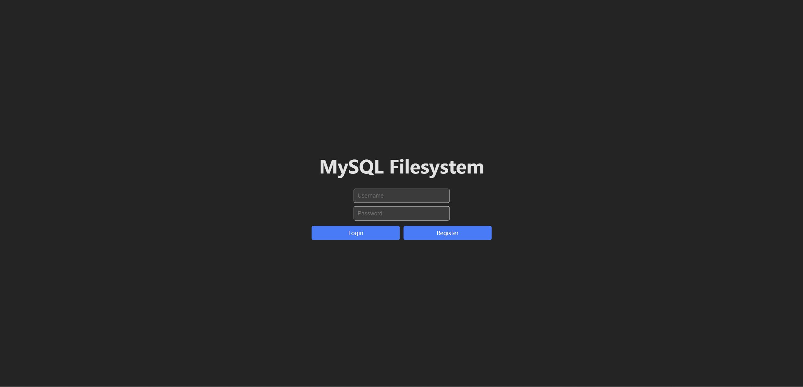
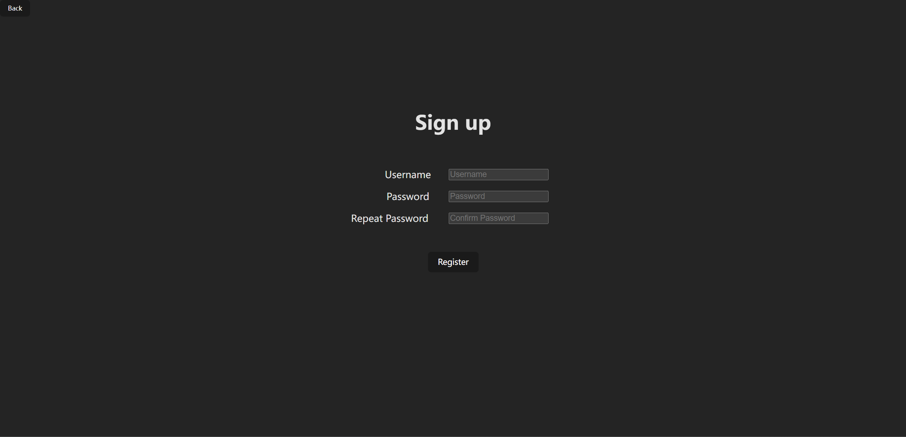
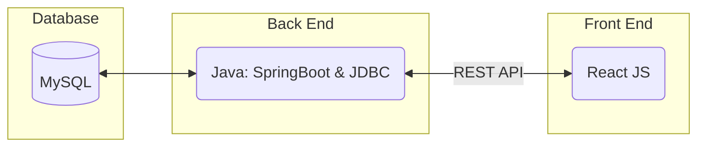
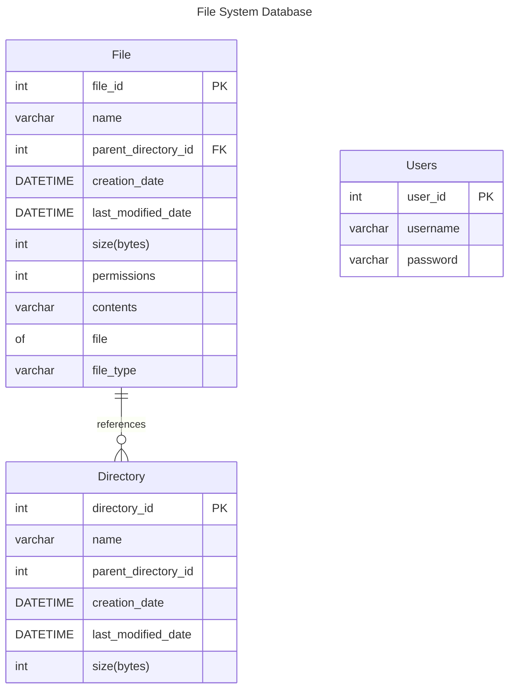
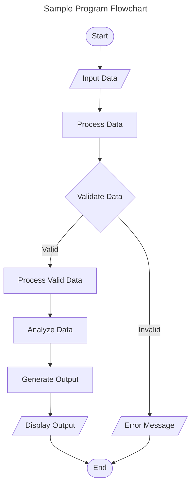
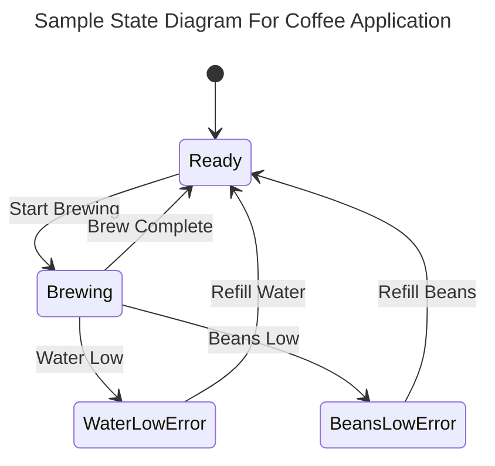
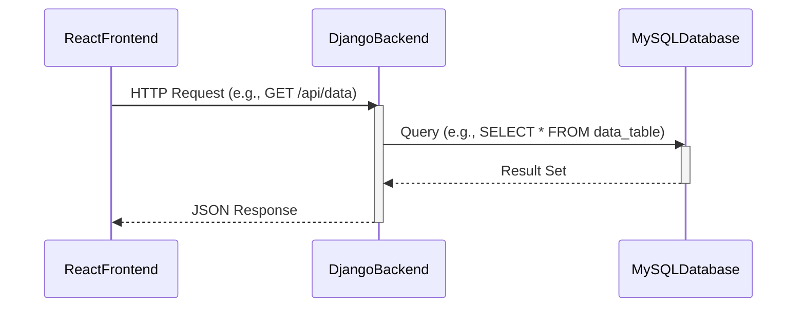
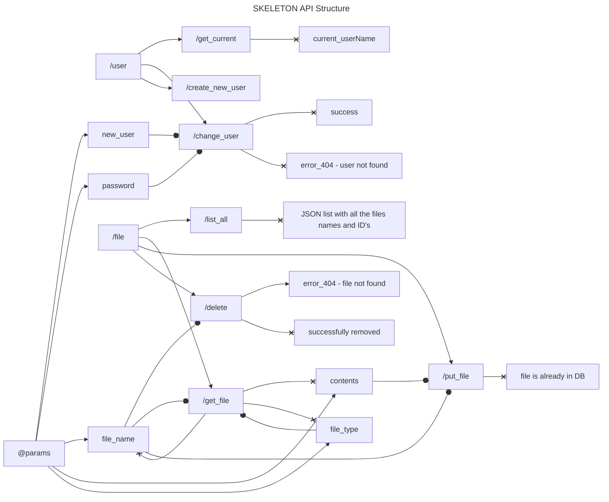

# Requirements and Specification Document

## TeamName

506 Studs

## Product Owner and Scrum Masters

Scrum 0/1:

- SM: Ian
- PO: Zaid

Scrum 2:

- SM: Tarkan
- PO: Hank

Scrum 3:

- SM: Jenny
- PO: Andrii

# Contributing

- Zhijing Liao: Backend
- Zaid Afifi: Frontend
- Ian Whitt: Backend
- Hank Zhang: Frontend
- Tarkan Fletcher: Backend
- Andrii Hopanchuk: Frontend

### Project Abstract

A file system is used to store, organize and manage files and directories in an operating system. The idea of this project is to implement an efficient filesystem using a relational database as the underlying storage system. The project should have a web interface that allows users to create, read, update and delete files, directories or subdirectories. Users should be able to visualize any directory or subdirectory as a tree structure in the web interface.

### Customer

<!--A brief description of the customer for this software, both in general (the population who might eventually use such a system) and specifically for this document (the customer(s) who informed this document). Every project will have a customer from the CS506 instructional staff. Requirements should not be derived simply from discussion among team members. Ideally your customer should not only talk to you about requirements but also be excited later in the semester to use the system.-->

### User Requirements

<!--This section lists the behavior that the users see. This information needs to be presented in a logical, organized fashion. It is most helpful if this section is organized in outline form: a bullet list of major topics (e.g., one for each kind of user, or each major piece of system functionality) each with some number of subtopics.-->

| ID  | Description                                                                                                                                                      | Priority | Status |
| --- | ---------------------------------------------------------------------------------------------------------------------------------------------------------------- | -------- |--------|
| R1  | When the user navigates to the website url, a home page shall appear with login and register options                                                             | Med      | Done   |
| R2  | After the user enters login information, the backend will verify credentials and the user shall be navigated to the home page                                    | Med      | Open   |
| R3  | After the user is navigated to the home page, the frontend will fetch all of the user's files from the backend and list of all the user's directories and files. | High     | Open   |
| R4  | When the user wants to upload a file, they will be able to click the button, and will be navigated to their file explorer                                        | Med      | Done   |
| R5  | After the user uploads a file, the file will be sent to the backend and the user's table will be updated in the database                                         | High     | Done   |
| R6  | When the user wants to view a file, they will be able to click on it, and the frontend will display the contents of the file in a modal                          | Med      | Done   |
| R7  | When the user is finished, they will be able to click the quit button, and the frontend will navigate them back to the login screen                              | Low      | Done   |
| R8  | In the Mainpage, users will be able to modify permissions for contents they have full admin access to                                                            | Med      | Open   |
| R9  | Users will be able to view the directory in a tree format                                                                                                        | Low      | Done   |
| R10 | Users will be able to write to a file once open and then save updated file | Low | Open   |
| R11 | Users will be able to delete a file that is no longer wanted | Low | Done   |

### Use Cases & User Stories

> As a user of a web-based filesystem manager, I want to be able to do the following:

1. Create an account in the application
2. Login into the web application
3. View content that I have the permission for
4. Be able to modify permissions for contents I have full admin access to
5. View the files and folders in a directory when clicked on it
6. View the contents of the file in the web application when clicked on it
7. Upload a new file that contains text
8. Create a new directory or subdirectory
9. Delete file or directory
10. Move file from one directory to another (Optional)
11. Cut, copy, paste file or directory (Optional)
12. View recently deleted files or directories in a trash folder (Optional)
13. Visualize any directory in a tree format
14. Do all these actions in a user friendly UI that resembles the file system in the operating systems.

### User Interface Requirements

<!--Describes any customer user interface requirements including graphical user interface requirements as well as data exchange format requirements. This also should include necessary reporting and other forms of human readable input and output. This should focus on how the feature or product and user interact to create the desired workflow. Describing your intended interface as “easy” or “intuitive” will get you nowhere unless it is accompanied by details.-->

<!--NOTE: Please include illustrations or screenshots of what your user interface would look like -- even if they’re rough -- and interleave it with your description.-->

#### Login Page

- The login page should contain a user input field.
- There should be clear navigations enable users to login or create a new account.

  

#### Register Page

- The register page should contain a user input field.
- There should be clear navigations enable users to finish registration.
- There should be a escape hatch button in this page.

  

#### Main Page

- There should be clear instruction for user to upload and manage files.
- There should be a logout button in this page.
- Implementation: TBA

### Security Requirements

This section outlines the security requirements when implementing the file stystem.

Frontend:

- Users should not worry about the leakage of username or password.
- The files should only available to the users with permission to it.

Backend:

- User information should be kept in a safe place.
- More TBA
<!--Discuss what security requirements are necessary and why. Are there privacy or confidentiality issues? Is your system vulnerable to denial-of-service attacks?-->

### System Requirements

<!--List here all of the external entities, other than users, on which your system will depend. For example, if your system inter-operates with sendmail, or if you will depend on Apache for the web server, or if you must target both Unix and Windows, list those requirements here. List also memory requirements, performance/speed requirements, data capacity requirements, if applicable.-->

| Behaviour and Functions | Description                                                                                                                                            |
| ----------------------- | ------------------------------------------------------------------------------------------------------------------------------------------------------ |
| Login Credential        | - The system should check for credential at the login page                                                                                             |
| Registration            | - The system should make sure there are no mutiple users with the same username  - The system should store the user credential in a secure database |
| Uploading files         | - The system should enable users to upload a file  - The file should be kept in a secure database.                                                  |
| Access to files         | - The system should enable users to manage file that they have permission of.                                                                          |
| Permission management   | - The system should allow users to change permission of a specific file.                                                                               |

### Specification

<!--A detailed specification of the system. UML, or other diagrams, such as finite automata, or other appropriate specification formalisms, are encouraged over natural language.-->

<!--Include sections, for example, illustrating the database architecture (with, for example, an ERD).-->

<!--Included below are some sample diagrams, including some example tech stack diagrams.-->

#### Technology Stack

#### Database

#### Class Diagram

TBA

#### Flowchart

#### Behavior

#### Sequence Diagram

### Backend API class Structure

Now, this might look like the biggest piece of spegetti ever, but let me explain a little. So starting out, there will be 2 controllers. One that is labeled **/user** and one that is **/file**. These will each be linked to their respectived databases.

Then if you follow the chart out from **/user** it will has three sub parts, these being **/get_current** (the current user that we are logged in as), **/change_user** (a user that we are moving to), and **/create_new_user** (a new user that we are creating). Then coming off the **@params** we can see that for both **/change_user** and **/create_new_user** we need an input of new_user and password. This is because we are going to be testing about these. These will be sent as a api from front using the **{url}/{location}?new_user={user_input}&password={user_input}**.

Ex. User inputs tarkan as the username and 506studs as the password

http://localhost:8080/user/change_user?new_user=tarkan&password=506studs

Then once we have the user logged in we should be using a **bean** to connect to the right DB so when we are trying to access files we are accessing the ones that are relevent to that user.

Now that we have the user information we can follow the **/file** lines to their respective api catches. These being **/list_all**, **/get_file**, **/put_file**, and **/delete**. These have input **@params** of file_name, file_type, contents. Using these conventions we should be able to work on both parts at once as long as the front and backend are using the same conventions.

Also work noting in the flow diagram, anything that has a **--o** is a input param, **-->** is the location that is linked, and **--x** is the output.
